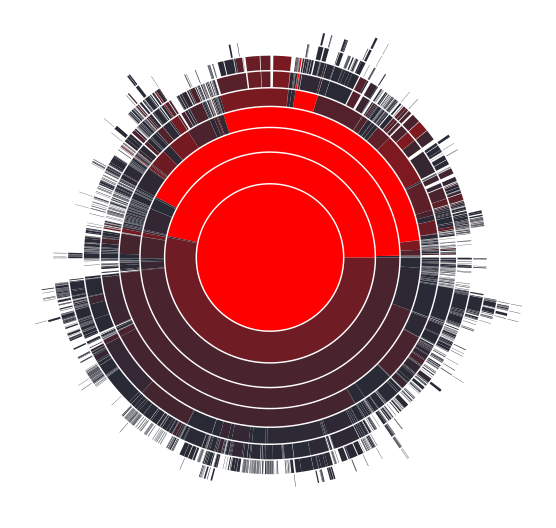

# HeatMap

A heat map browser of the last modification of a git repository 

## Installation

```st
Metacello new
  baseline: 'HeatMap';
  repository: 'github://moosetechnology/HeatMap:main/src';
  load.
```

## Usage

To use this heat map:

1. Create a repository using LibGit
    ```st
    | repo branch gitHeatMap |
    repo := IceLibgitRepository new
        name: 'aName';
        location: ('D:\Path\To\Folder' asFileReference);
        initBare: false;
        yourself.
    ```
2. Configure the GitHeatMap
    ```st
    gitHeatMap := HMGitHeatMap new
        branchName: 'main';
        repository: repo;
        maxNumber: 10.
    ```
3. Open the visualization
    ```st
    gitHeatMap open
    ```

## Architectural HeatMap

You can also build an architectural heat map with the following piece of code:

### Using GitModel

```st
glhModel := GLHModel new.

glhApi := GLHApi new
    privateToken: '<my token>';
    baseAPIUrl:'<my base api>';
    yourself.

glhImporter := GLHModelImporter new
    glhApi: glhApi;
    glhModel: glhModel.

"137 is the ID of the a Group, you can find the number in the webpage of every project and group"
glhImporter importGroup: 131.

myProject := ((glhModel allWithType: GLHProject) select: [ :project | project name = '<project name>' ]) anyOne.
glhImporter importCommitsOf: myProject withStats: true until: '2023-01-01' asDate.


bag := Bag new.
myProject repository commits do: [ :aCommit |
(NeoJSONObject fromString: (glhApi commitDiff: aCommit id ofProject: myProject id unidiff: false)) do: [:diffFile |
        bag add: diffFile new_path asFileReference basename
    ] ].


frPackage := (((myProject allWithType: FamixJavaPackage) select: [ :package | package parentPackage isNil ]) detect: [ :package | package name = 'fr' ]).


architecturalHeatMap := HMHeatMap new.
architecturalHeatMap root: frPackage.
architecturalHeatMap hideNodeBlock: [ :node | node value < 100 ].
architecturalHeatMap fileValueBlock: [ :child | bag occurrencesOf: child name ].
architecturalHeatMap childrenBlock: [ :node | node children select: [ :child | (child isKindOf: FamixJavaPackage) or: [ child isKindOf: FamixJavaClass ] ] ].
architecturalHeatMap collapseBlock: [ :node | node value <= 5000 ].
architecturalHeatMap nodeNameBlock: [ :node | node name ].

architecturalHeatMap build.
architecturalHeatMap rootNode open.

```

## Sunburst HeatMap

### Using GitModel

```st
glhModel := GLHModel new.

glhApi := GLHApi new
    privateToken: '<my token>';
    baseAPIUrl:'<my base api>';
    yourself.

glhImporter := GLHModelImporter new
    glhApi: glhApi;
    glhModel: glhModel.

"137 is the ID of the a Group, you can find the number in the webpage of every project and group"
glhImporter importGroup: 131.

myProject := ((glhModel allWithType: GLHProject) select: [ :project | project name = '<project name>' ]) anyOne.
glhImporter importCommitsOf: myProject withStats: true until: '2023-01-01' asDate.


bag := Bag new.
myProject repository commits do: [ :aCommit |
(NeoJSONObject fromString: (glhApi commitDiff: aCommit id ofProject: myProject id unidiff: false)) do: [:diffFile |
        bag add: diffFile new_path asFileReference basename
    ] ].


frPackage := (((myProject allWithType: FamixJavaPackage) select: [ :package | package parentPackage isNil ]) detect: [ :package | package name = 'fr' ]).

sunburst := HMHeatSunburstBuilder new.
sunburst root: frPackage.
sunburst nodeValueBlock: [ :child | (bag occurrencesOf: child name) ].
sunburst childrenBlock: [ :node | node children select: [ :child | (child isKindOf: FamixJavaPackage) or: [ child isKindOf: FamixJavaClass ] ] ].

sunburst buildShapes.
sunburst canvas @ RSCanvasController.
sunburst build.
sunburst shapes @ RSPopup.
sunburst canvas
```


